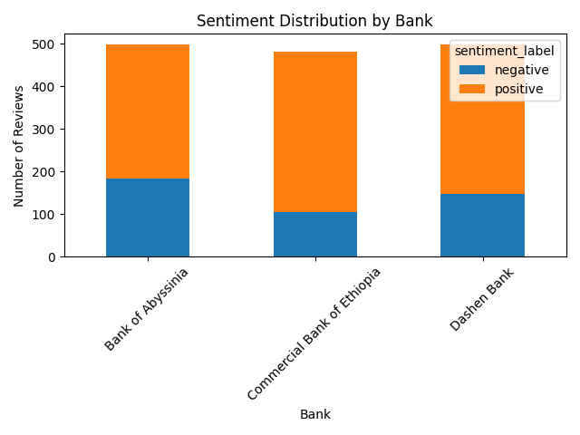
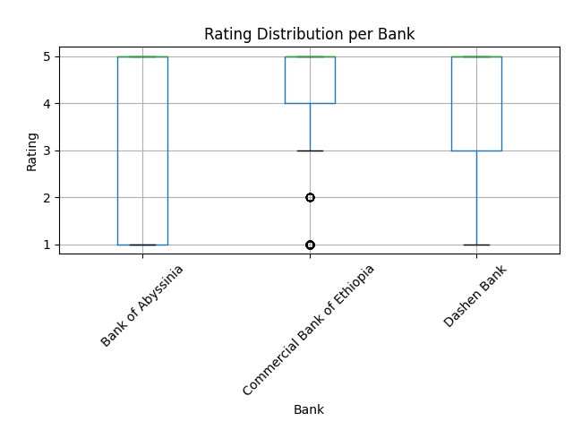
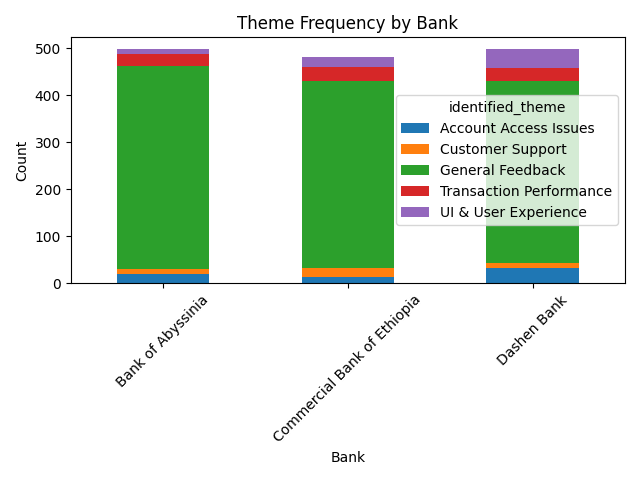

# Final Report: Fintech Review Analytics

## Executive Summary

This project evaluates mobile app reviews for three leading Ethiopian banks to identify sentiment trends, service themes, and opportunities for customer experience improvement. The analysis used a cleaned review dataset, a transformer-based sentiment classifier, and keyword-driven theme mapping to derive actionable insights. The final output includes a database-ready review dataset, three visualizations, and bank-specific recommendations.

## Data Collection Methodology and Quality Assessment

Data for the analysis is sourced from `data/raw/fintech_reviews_cleaned.csv`. The repository also includes a placeholder scraping module at `scripts/scrape_reviews.py`, but the current pipeline relies on the available cleaned dataset rather than an end-to-end scraper.

Quality assessment findings:

- Total review records: 1,477
- No missing values in key fields: review text, rating, date, bank, and source
- Duplicate review texts detected: 343
- Bank distribution:
  - Bank of Abyssinia: 498 reviews
  - Dashen Bank: 498 reviews
  - Commercial Bank of Ethiopia: 481 reviews

The dataset is robust for exploratory analysis, but duplicate content and lack of scraper provenance are important quality caveats.

## Sentiment Analysis Methodology

Sentiment analysis was performed in `scripts/sentiment_analysis.py` with the following process:

1. Preprocess review text by lowercasing, removing non-letter characters, tokenizing, and filtering English stopwords.
2. Apply the `transformers` sentiment pipeline with the `distilbert-base-uncased-finetuned-sst-2-english` model.
3. Map model labels to `positive` or `negative` and store the confidence score.

**Tool selection rationale:**

- `distilbert-base-uncased-finetuned-sst-2-english` provides a good balance between inference speed and binary sentiment accuracy for English text.
- The Hugging Face `transformers` pipeline simplifies model execution and standardizes the sentiment output.

### Sentiment Results

- Positive reviews: 1,040
- Negative reviews: 437
- Overall average sentiment score: 0.966

Average sentiment score by bank:

- Bank of Abyssinia: 0.962
- Dashen Bank: 0.967
- Commercial Bank of Ethiopia: 0.968

Average sentiment score by rating:

- Rating 1: 0.971
- Rating 2: 0.952
- Rating 3: 0.954
- Rating 4: 0.942
- Rating 5: 0.968

These results show a strong positive skew across the dataset, with a meaningful minority of critical reviews that relate to access, performance, and customer support.

## Thematic Analysis Findings

Themes were identified using keyword rules inside `scripts/sentiment_analysis.py`.

Theme categories:

- Account Access Issues
- Transaction Performance
- UI & User Experience
- Customer Support
- General Feedback

Overall theme distribution:

- General Feedback: 1,217 reviews
- Transaction Performance: 82 reviews
- UI & User Experience: 72 reviews
- Account Access Issues: 65 reviews
- Customer Support: 41 reviews

Top keywords extracted from TF-IDF analysis include:

`app`, `bank`, `banking`, `best`, `cant`, `dashen`, `easy`, `even`, `fast`, `fix`, `good`, `like`, `mobile`, `nice`, `please`, `time`, `update`, `use`, `work`, `working`

### Theme distribution by bank

- Bank of Abyssinia has the highest relative share of account access and customer support comments.
- Dashen Bank has the most theme counts in transaction performance and UI concerns.
- Commercial Bank of Ethiopia shows relatively stable sentiment but still has room to strengthen usability and support response.

## Database Design Overview

The analysis pipeline supports PostgreSQL ingestion via `scripts/load_to_postgres.py`.

Schema in `schema.sql`:

- `banks` table: `bank_id`, `bank_name`, `app_name`
- `reviews` table: `review_id`, `bank_id`, `review_text`, `rating`, `review_date`, `sentiment_label`, `sentiment_score`, `identified_theme`, `source`

The database design separates bank metadata from review data, making it easy to join review metrics with bank identifiers.

**Implementation note:** the current loader sets `review_date` to `NULL` in `scripts/load_to_postgres.py`, which should be corrected to preserve date values from the source file.

## Insights and Visualizations

The report includes three key charts:

1. `sentiment_distribution.png` — sentiment distribution by bank
2. `rating_distribution.png` — rating distribution per bank
3. `theme_frequency.png` — theme frequency by bank

Key insights:

- Sentiment is broadly positive but not uniformly so; negative reviews are concentrated around service friction points.
- Commercial Bank of Ethiopia leads in average sentiment score, while Bank of Abyssinia has the largest negative-review share.
- Transaction performance and access issues are the most actionable themes beyond generic feedback.
- Ratings alone are not fully aligned with sentiment: mid-tier ratings still include negative sentiment scores.

## Bank-Specific Recommendations

**Bank of Abyssinia**

- Prioritize login and account access reliability.
- Improve customer support response for users reporting blocked access.
- Share communication updates when outages or app changes occur.

**Dashen Bank**

- Optimize transaction performance and reduce latency in money transfers.
- Improve mobile app stability around `login`, `transfer`, and `transaction` flows.
- Refine UI messaging for failure states and transaction confirmations.

**Commercial Bank of Ethiopia**

- Continue strengthening the positive user experience.
- Address UI and usability feedback, especially for mobile navigation.
- Monitor customer support issues to prevent small service gaps from eroding trust.

## Ethical Considerations and Limitations

- The dataset is drawn from Google Play reviews, which may over-represent users who feel strongly enough to comment.
- Negative and positive sentiments may be biased by review sampling and user motivation.
- The sentiment model is English-only and may not capture local phrasing or regional expressions accurately.
- Duplicate reviews (343 occurrences) may distort frequency-based analysis.
- Theme classification is rule-based and may miss subtler or multi-topic comments.
- The scraper module is not implemented, limiting transparency in the collection pipeline.

## Suggested Next Steps

1. Implement the scraper pipeline and record provenance for each review source.
2. Deduplicate reviews before analysis and apply source-level audit checks.
3. Enhance theme detection with supervised classification or topic modeling.
4. Preserve `review_date` in database ingestion and enable time-series trend analysis.
5. Expand data sources beyond Google Play to include the Apple App Store and direct bank feedback channels.
6. Build an interactive dashboard for ongoing monitoring of sentiment, theme, and rating changes.

---

*Prepared using the fintech review analytics repository and transformer-based sentiment analysis.*
